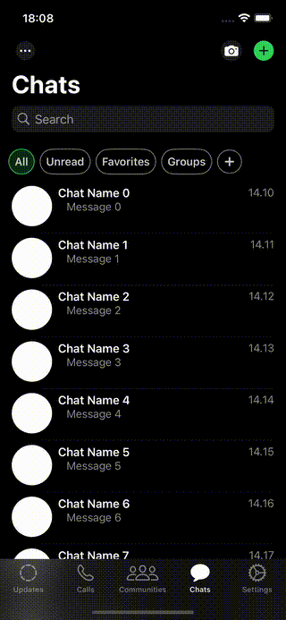

# 📱 WhatsApp Clone

A beautiful WhatsApp UI clone built with SwiftUI for iOS. This project recreates the WhatsApp interface with modern iOS design patterns and SwiftUI components.

> **Note:** This is a UI-only implementation. Backend functionality and real messaging features are not implemented.

## 🎥 Demo



> The demo shows the main features of the app including all tabs: Updates, Calls, Communities, Chats, and Settings.

## ✨ Features

### UI Components
- Custom tab bar with dynamic icons
- WhatsApp-style color scheme
- Chat bubbles with tails (incoming/outgoing)
- Custom backgrounds and assets
- Adaptive light/dark mode support

## 🛠 Tech Stack

- **SwiftUI** - Modern declarative UI framework
- **iOS 15.0+** - Minimum deployment target
- **Xcode 13+** - Development environment
- **Swift 5.5+** - Programming language

## 🚀 Getting Started

### Prerequisites
- macOS with Xcode 13 or later installed
- iOS Simulator or physical iOS device
- Basic knowledge of SwiftUI

### Installation

1. Clone the repository
```bash
git clone https://github.com/yourusername/WhatsAppClone.git
cd WhatsAppClone
```

2. Open the project in Xcode
```bash
open WhatsAppClone.xcodeproj
```

3. Select your target device (Simulator or physical device)

4. Build and run the project
   - Press `Cmd + R` or click the Play button in Xcode

## 🎨 Design Features

- **Custom Tab Icons**: Dynamic tab bar icons that change when selected
- **WhatsApp Color Scheme**: Authentic WhatsApp green (#25D366) and UI colors
- **Chat Bubbles**: Custom message bubbles with tails
- **Background**: WhatsApp-style chat backgrounds
- **App Icon**: Custom WhatsApp-inspired app icon

## 🔄 Current Status

This project currently implements:
- ✅ Complete UI structure
- ✅ Navigation between tabs
- ✅ Custom assets and colors
- ✅ SwiftUI components

## 📝 License

This project is for educational purposes only. WhatsApp is a trademark of Meta Platforms, Inc.

## 👨‍💻 Author

**Turker Alan**

- GitHub: [@alanturker](https://github.com/alanturker)

## 🙏 Acknowledgments

- WhatsApp UI design inspiration
- SwiftUI community
- iOS development resources

---

**Note:** This is a learning project and is not affiliated with or endorsed by WhatsApp or Meta Platforms, Inc.
